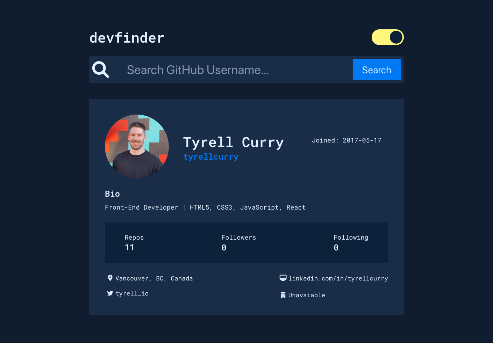
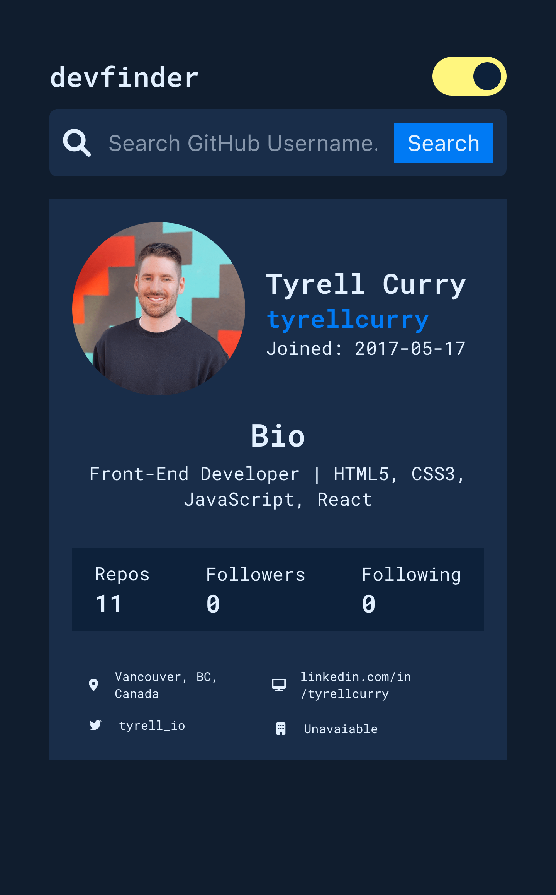

# devfinder - A GitHub User Search

## Table Of Contents

- [Overview](#overview)
  - [Project Goals](#project-goals)
  - [Screenshot](#screenshot)
  - [Links](#links)
- [The Process](#the-process)
  - [Built with](#built-with)
  - [What I learned](#what-i-learned)
  - [Useful resources](#useful-resources)
- [Author](#author)
- [Acknowledgments](#acknowledgments)

## Overview

### Project Goals

Users should be able to:

- View the optimal layout for the site depending on their device's screen size
- See hover states for all interactive elements on the page
- Search for GitHub users by their username
- See relevant user information based on their search
- Switch between light and dark themes

## Screenshots

### Desktop Version



### Mobile Version



### Links

- Live Site URL: [Netlify](https://github-user-search-tc.netlify.app/)

## The Process

### Built with

- React JS
- Flexbox
- Axios
- UseState
- Local Storage

### What I learned

In this project I learned about utilizing `state` and passing `props` between sibling `Components`. I gained additional experience retrieving and populating `API` data using `Axios`. I learned about utilizing a `data-theme` in `css` and creating a darkmode toggle via `css variables`.

```js
<Navbar theme={theme} switchTheme={switchTheme} />
<Search theme={theme} setUserData={setUserData} />
<Content theme={theme} userData={userData} />
```

```js
export const getUser = async (submittedUser) => {
  try {
    const response = await axios.get(url + submittedUser, options);
    return response;
  } catch (error) {
    console.error(error);
  }
};
```

### Useful resources

- [Axios Getting Started](https://axios-http.com/docs/intro) - The workflow that we used on this project.
- [Passing Data Between Siblings](https://www.youtube.com/watch?v=Qf68sssXPtM&t=243s) - This video covers a simple way to pass state between siblings without relying on a state management library.

## Author

- Author - [Tyrell Curry](https://tyrellcurry.io)

## Acknowledgments

Shoutout to [Rod Garland](https://github.com/zencoder24) for helping me with managing state for the darkmode toggle.

--

#### Live Site URL: [Netlify](https://github-user-search-tc.netlify.app/)
